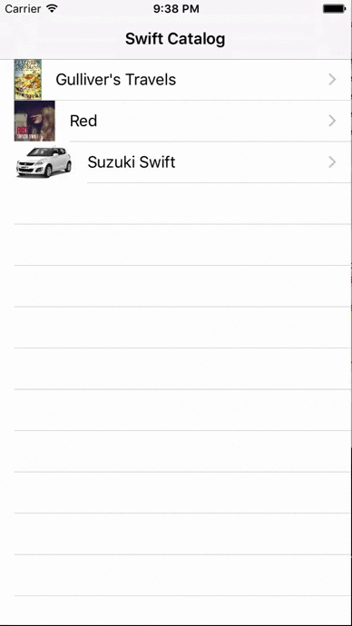
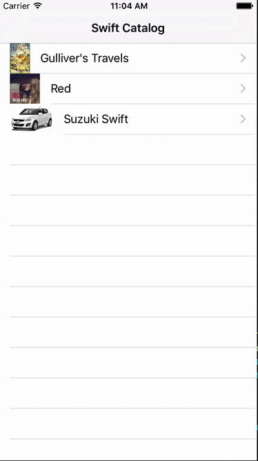

# SwiftCatalog, the project for [Pretty Swift](http://www.prettyswift.co)

Completing the SwiftCatalog project for [Pretty Swift](http://www.prettyswift.co/lessons/) will teach you the highlights of iOS development and reinforce the concepts you learned in the Pretty Swift course.

SwiftCatalog is a master-detail application that lets users browse Swift-related products. The requirements for each part of the sample project are below. When you are finished, the application will have to screens: a master screen that shows a list of catalog items and a detail screen showing more information about a selected catalog item.

# Learning Objectives
- Reinforce the concepts you learned in the Pretty Swift Lessons
- Learn how translate a requirement and UI design into working code
- Gain exposure resources like Apple's documentation and [StackOverflow](http://stackoverflow.com) that professional iOS developers use
- Advance your iOS skills by working on an open-ended project, rather than a step by step tutorial

# Organization
You will need to clone this repository by following [these instructions](https://help.github.com/articles/cloning-a-repository/). The clone URL is `https://github.com/PrettySwift/SwiftCatalog.git`.

This repository has a branch for each step in the project. Read [this tutorial](https://www.atlassian.com/git/tutorials/using-branches) for more information about branching in Git.

If you get stuck, you can find a proposed solution to an exercise by moving to the next branch in the project. For example, if you get stuck in the `view-controllers` section, you can move to the `views` section to see a solution to the `view-controllers` problem. Each new problem branch contains the cumulative solution to all the previous problems.

Look at the `master` branch to see a solution for the completed project. When you are finished, your project should look similar to these screenshots.

# Project instructions

## [View Controllers](http://www.prettyswift.co/lessons/view-controllers/)
Create a view controller that shows details about a Swift item that customers can order from the Swift Catalog.

### Tasks
- Checkout the `view-controllers` branch
- In *Main.storyboard*, edit the *Item View Controller Scene* to look like the screenshot below. You will not need to write any Swift code to complete this exercise.

## [Views](http://www.prettyswift.co/lessons/views/)
Make a custom `UIImageView` subclass that displays an image inside a circle with a colored border.

### Tasks
- Checkout the `views` branch
- Edit the file *CircularImageView.swift* to create a custom view that displays an image inside a circle with a colored circle.
- As you make changes to the `CircularImageView`, look at the storyboard. You should see the image view in the storyboard update to reflect your changes.

## [Models](http://www.prettyswift.co/lessons/models/)
Create a model object to represent items in the Swift catalog.

### Tasks
- Checkout the `models` branch
- Edit the file *CatalogItem.swift* to model an item from the Swift catalog. An item has a title of type `String`, an image of type `UIImage`, an item description of type `String`, category of type `String`, and an order quantity of type `Int`. Think about which attributes should be mutable and which should be immutable.

## [Tables](http://www.prettyswift.co/lessons/tables/)
Create a table to show a list of all the items sold in the Swift Catalog.

### Tasks
- Checkout the `tables` branch
- Edit `CatalogTableViewController` to implement the appropriate `UITableViewDelegate` and `UITableViewDataSource` methods.

## [Navigation](http://www.prettyswift.co/lessons/navigation/)
Navigate between the catalog screen and the catalog item details screen. Learn how to pass information between View Controllers.

### Tasks
- Checkout the `navigation` branch
- Edit `CatalogTableViewController` and `ItemViewController` to pass currently selected `CatalogItem` from the `CatalogTableViewController` instance to the `ItemViewController` instance. Create IBOutlets from the storyboard to `ItemViewController`.

## [Persistence](http://www.prettyswift.co/lessons/persistence/)
React to changes in order quantity. Persist order quantities to disk so the app remembers quantities between app launches.

### Tasks
- Checkout the `persistence` branch
- Edit `ItemViewController` to react to changes in order quantity. You will need to create IBOutlets for the order quantity label and stepper.
- When the stepper's value changes, set the quantity on the catalog item to the stepper's new value
- Edit `CatalogItem` to persist the new value of order quantity.

