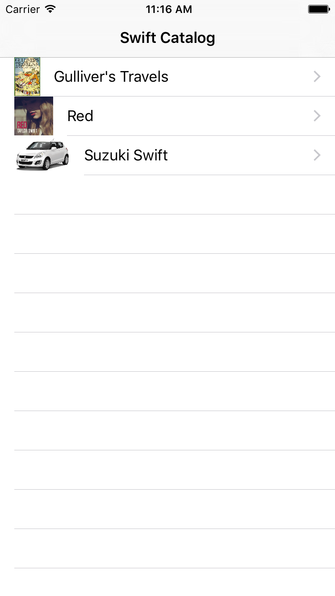
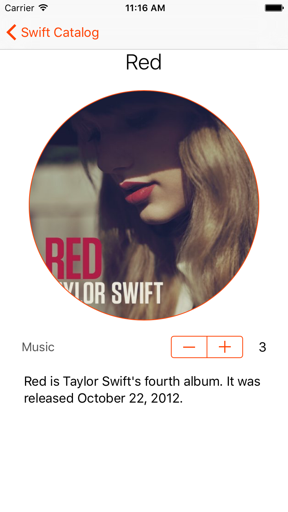
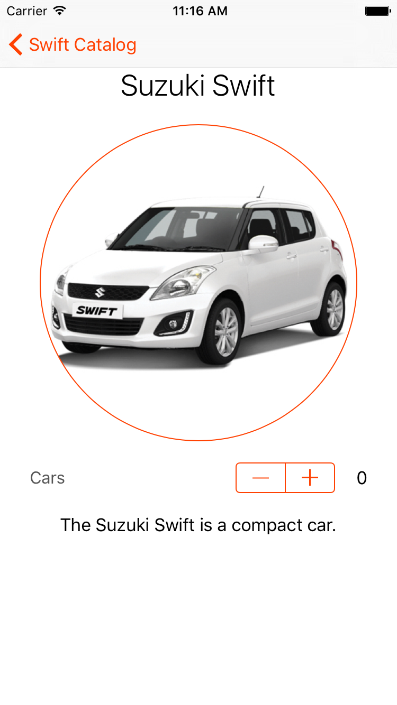

# SwiftCatalog, the project for [Pretty Swift](http://www.prettyswift.co)

Completing the SwiftCatalog project for [Pretty Swift](http://www.prettyswift.co/lessons/) will teach you the highlights of iOS development and reinforce the concepts you learned in the Pretty Swift course.

SwiftCatalog is a master-detail application that lets users browse Swift-related products. The requirements for each part of the sample project are below. When you are finished, the application will have to screens: a master screen that shows a list of catalog items and a detail screen showing more information about a selected catalog item.

# Learning Objectives
- Reinforce the concepts you learned in the Pretty Swift Lessons
- Learn how translate a requirement and UI design into working code
- Gain exposure resources like Apple's documentation and [StackOverflow](http://stackoverflow.com) that professional iOS developers use
- Advance your iOS skills by working on an open-ended project, rather than a step by step tutorial

# Organization
You will need to clone this repository by following [these instructions](https://help.github.com/articles/cloning-a-repository/). The clone URL is `https://github.com/PrettySwift/SwiftCatalog.git`.

This repository has a branch for each step in the project. Read [this tutorial](https://www.atlassian.com/git/tutorials/using-branches) for more information about branching in Git.

If you get stuck, you can find a proposed solution to an exercise by moving to the next branch in the project. For example, if you get stuck in the `view-controllers` section, you can move to the `views` section to see a solution to the `view-controllers` problem. Each new problem branch contains the cumulative solution to all the previous problems.

Look at the `master` branch to see a solution for the completed project. When you are finished, your project should look similar to these screenshots.

# Project instructions

## View Controllers
Create a view controller that shows details about a Swift item that customers can order from the Swift Catalog.

### Tasks
- Checkout the `view-controllers` branch
- In *Main.storyboard*, edit the *Item View Controller Scene* to look like the screenshot below. You will not need to write any Swift code to complete this exercise.
